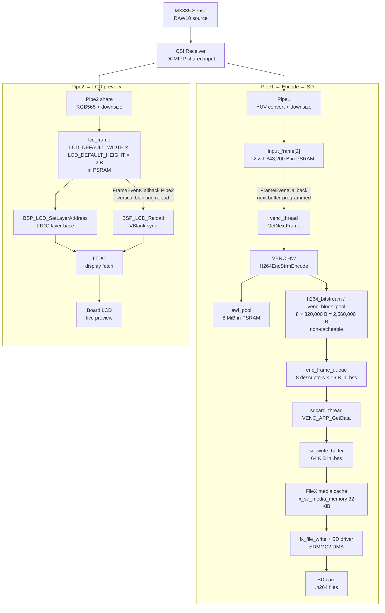

# Video-Pipeline Zusammenfassung

Die Initialisierung der Kamera-Pipeline beginnt in `MX_DCMIPP_Init()`. Dort wird `DCMIPP_PIPE1` für den Aufnahme- und Encoderpfad konfiguriert: CSI-Input, YUV-Konvertierung, Downsize und das Ausgabeformat für den Encoder. Der eigentliche Start der Pipe1-Capture erfolgt später in `encoder_start()`, das über `dcmipp_config(GetInputFrame(NULL))` die erste Zieladresse für den Capture-Buffer setzt und danach den Encoder-Stream vorbereitet.

Der Vorschaupfad auf das LCD wird in `lcd_init()` aktiviert. Diese Funktion schaltet `DCMIPP_PIPE2` per `HAL_DCMIPP_PIPE_CSI_EnableShare()` auf denselben Kameraeingang, konfiguriert RGB565 plus Downsize, legt `lcd_frame` als Zielbuffer fest und startet die Pipe mit `HAL_DCMIPP_CSI_PIPE_Start()`. Über `BSP_LCD_SetLayerAddress()` wird derselbe Buffer direkt an den LTDC gebunden. Wenn `BSP_CAMERA_FrameEventCallback()` für `DCMIPP_PIPE2` aufgerufen wird, triggert der Code mit `BSP_LCD_Reload(0, BSP_LCD_RELOAD_VERTICAL_BLANKING)` das saubere Umschalten zur nächsten Darstellung.

Die eigentliche Aufnahme- und Encode-Kette läuft im Thread `venc_thread_func()`. Nach `VENC_APP_EncodingStart()` wartet der Thread auf `FRAME_RECEIVED_FLAG`. Dieses Flag wird in `BSP_CAMERA_FrameEventCallback()` gesetzt, sobald `DCMIPP_PIPE1` einen Frame fertiggestellt hat. Im selben Callback wird mit `dcmipp_set_memory_address(GetNextFrame(frame_received))` sofort der nächste Input-Buffer programmiert, sodass die Capture-Pipeline kontinuierlich weiterlaufen kann. In der aktuellen 720p-Frame-Konfiguration liegen die Eingabebuffer als `input_frame[2]` in PSRAM; jeder Buffer ist 1,843,200 Byte groß.

Für die H.264-Erzeugung verwendet `encode_frame()` den nächsten Capture-Buffer über `GetNextFrame(nb_encoded_frame)` und ruft anschließend `H264EncStrmEncode()` auf. Der Encoder-Arbeitsbereich liegt in `ewl_pool` mit 8 MiB in PSRAM. Der komprimierte Bitstream landet in `h264_bitstream`, das als non-cacheable Buffer mit insgesamt 2,560,000 Byte angelegt ist. Dieser Bereich wird beim Start von `venc_thread_func()` per `tx_block_pool_create()` als `venc_block_pool` in 8 Blöcke zu je 320,000 Byte aufgeteilt. Jeder erfolgreich encodierte Frame wird als `venc_output_frame_t` über `tx_queue_send()` in `enc_frame_queue` gestellt.

Der SD-Schreibpfad läuft separat in `sdcard_thread_func()`. Dieser Thread holt Daten mit `VENC_APP_GetData()`, das jeweils einen Eintrag aus `enc_frame_queue` liest und dabei den zuvor verwendeten Block wieder an `venc_block_pool` zurückgibt. Vor dem Schreiben wartet `sdcard_thread_func()` explizit auf einen ersten I-Frame, also auf den Rückgabewert `H264ENC_INTRA_FRAME`. Die eigentlichen Bitstream-Daten werden zunächst in `sd_write_buffer` gesammelt, einem 64-KiB-Puffer im `.bss`, und anschließend sektorweise über `VENC_FileX_write()` in das Dateisystem geschrieben. FileX nutzt zusätzlich `fx_sd_media_memory` als 32-KiB-Mediencache.

Der letzte Hardware-Schritt zur SD-Karte liegt unterhalb von FileX im SD-Treiber. `VENC_FileX_write()` ruft `fx_file_write()` auf, das schließlich im Glue-Layer `fx_stm32_sd_write_blocks()` auf `HAL_SD_WriteBlocks_DMA()` führt. Damit verlassen die H.264-Daten den Softwarepfad und werden per `SDMMC2`-DMA auf die SD-Karte geschrieben. Die Datei-Rotation erfolgt in `sdcard_thread_func()` immer erst dann, wenn `NB_FRAMES_PER_FILE` erreicht ist und gleichzeitig wieder ein I-Frame vorliegt.

## Architektur-Bewertung

Die aktuelle Architektur ist auf Robustheit und Entkopplung ausgelegt. `VENC_HW_MODE_ENABLE` ist derzeit `0U`, also Frame-Mode mit Vollbild-Capture und Software-Synchronisation über `FRAME_RECEIVED_FLAG`. Das ist für parallele LCD-Vorschau, H.264-Encode und SD-Schreiben die konservative und gut beherrschbare Variante. Sie toleriert Jitter im SD-Pfad besser, weil `venc_block_pool`, `enc_frame_queue` und `sd_write_buffer` den Datenfluss zwischen Kamera, Encoder und Dateisystem puffern.

Die Buffer-Verteilung ist für diese Betriebsart grundsätzlich sinnvoll. `input_frame[2]` liegt in PSRAM, weil der Doppelbuffer bei 720p YUV422 bereits 3,686,400 Byte benötigt und damit nicht sinnvoll in die interne `NOCACHE_Region` passt. `h264_bitstream` liegt dagegen in der internen non-cacheable Region und wird über `venc_block_pool` in 8 Output-Blöcke zerlegt. Das ist nicht zwingend deshalb optimal, weil der H.264-Ausgang grundsätzlich der schnellste Pfad wäre, sondern vor allem, weil der große Capture-Buffer extern ausgelagert werden musste und der Output-Pfad gleichzeitig DMA-freundlich und kohärent bleiben soll.

`ewl_pool` ist mit 8 MiB der größte Einzelbuffer. Seine Größe wird im Projekt nicht aus Bitrate, Auflösung oder GOP berechnet, sondern statisch über `VENC_POOL_SIZE` vorgegeben. Praktisch ist das als Workspace-Reserve für die VENC/EWL-Implementierung zu verstehen, nicht als direkt aus dem sichtbaren Anwendungscode herleitbare Nutzdatenmenge.

Die Kombination aus `venc_block_pool` und `sd_write_buffer` ist funktional sinnvoll. Der Block-Pool entkoppelt Producer und Consumer auf Frame-Ebene, während `sd_write_buffer` kleine oder unregelmäßige H.264-Chunks zu größeren, sektorfreundlichen SD-Schreibzugriffen bündelt. Ein reiner Ping-Pong-Output-Buffer wäre nur dann klar performanter, wenn der SD-Pfad garantiert schnell genug und zeitlich deterministisch wäre. Diese Annahme ist bei FileX und SDMMC-DMA typischerweise nicht belastbar genug.

Zur im Referenzmanual beschriebenen Upstream-Synchronisation: Ja, prinzipiell kann der VENC performanter im Hardware-Handshake-Modus betrieben werden, sodass kein Full-Frame-Input-Buffer mehr nötig ist. Im vorliegenden Projekt ist dieser Modus aber bewusst nicht aktiv. Gegen ihn sprechen vor allem die engere Kopplung zwischen DCMIPP und VENC, die geringere Fehlertoleranz bei Timing-Abweichungen und die höhere Integrationssensitivität. Das zeigt sich auch daran, dass der Code im Handshake-Fall Overflow bereits über `nbLineEvent != 0U` erkennt und `H264ENC_FUSE_ERROR` explizit behandelt.

## Mögliche Zielarchitektur

Falls später auf Handshake-Streaming umgestellt werden soll, ist die naheliegende Zielarchitektur: `DCMIPP_PIPE1` liefert nicht mehr in `input_frame[2]`, sondern in einen kleinen Line-/Wrap-Buffer; der VENC läuft mit `inputLineBufEn`, `inputLineBufLoopBackEn` und `inputLineBufHwModeEn`; `VIEW_MODE` wechselt von `H264ENC_BASE_VIEW_DOUBLE_BUFFER` auf `H264ENC_BASE_VIEW_SINGLE_BUFFER`; `NB_INPUT_FRAME` sinkt von `2U` auf `1U`; `INPUT_FRAME_SIZE` schrumpft von Full-Frame-Größe auf einen kleinen Streaming-Buffer. Der Output-Pfad über `h264_bitstream`, `venc_block_pool`, `enc_frame_queue`, `sd_write_buffer` und `VENC_FileX_write()` kann im Wesentlichen bestehen bleiben, weil die Entkopplung zur SD-Karte weiterhin benötigt wird.

Die sinnvolle Zielrichtung wäre daher nicht, den Encoder-Thread vollständig zu entfernen, sondern die Eingangsstufe zu verschlanken. Der größte Gewinn läge im Wegfall des großen `input_frame[2]`-Buffers und in der Reduktion externer Speicherbandbreite zwischen DCMIPP und VENC. Der Preis dafür ist ein empfindlicheres System, das genauer auf Format, Line-Wrapping, Synchronisation und Fehlerbehandlung abgestimmt werden muss.

